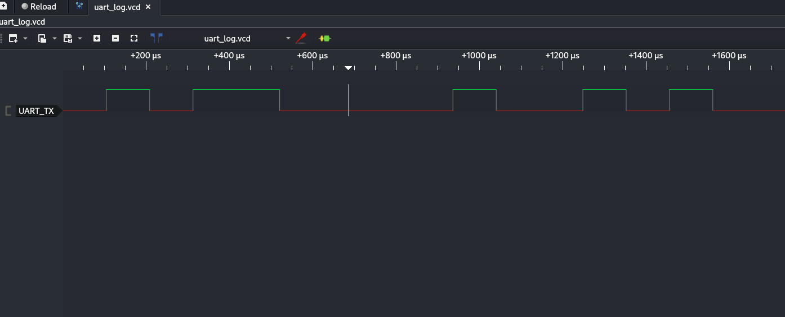
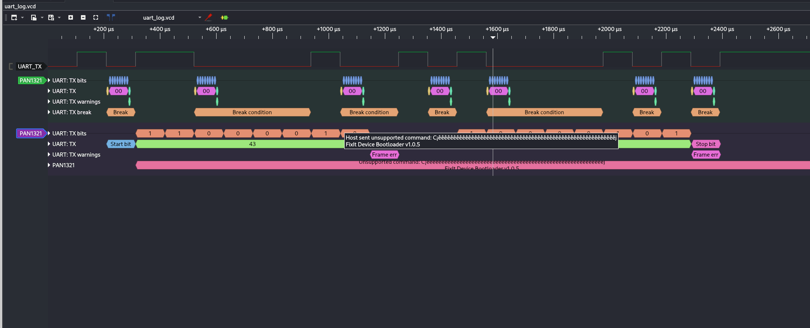
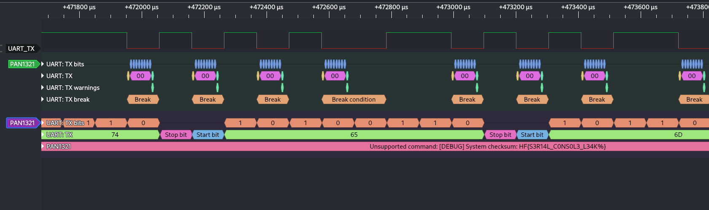

# 01 UART Debugging
We are given a file called `uart_log.vcd` which obviously sounds like a UART file. So we get a program to view UART data, like [Pulseview](https://sigrok.org/wiki/PulseView) where we get the following view when opening.

This doesn't show us that much since it's just the TX. However, Pulseview has the yellow and green button which allows us to add a protocol debugger. We can see which are available and sort by UART here: [Protocol Decoders](https://sigrok.org/wiki/Protocol_decoders).

Going through each of them, we don't really get anything useful. But by going through some common settings like Baud rate on them, we find some information when using the PAN1321 decoder with baud rate at 9600 instead of the default 115200, we can see some new information.

The green debugger is the default and the purple is the modified one.

We see that it says it is using the fixit bootloader, who is the author of the challenge. Which says to us that we are on the right track.

Going further in the log at around 470000 microseconds we find the flag: `HF{S3R14L_C0NS0L3_L34K%}`

