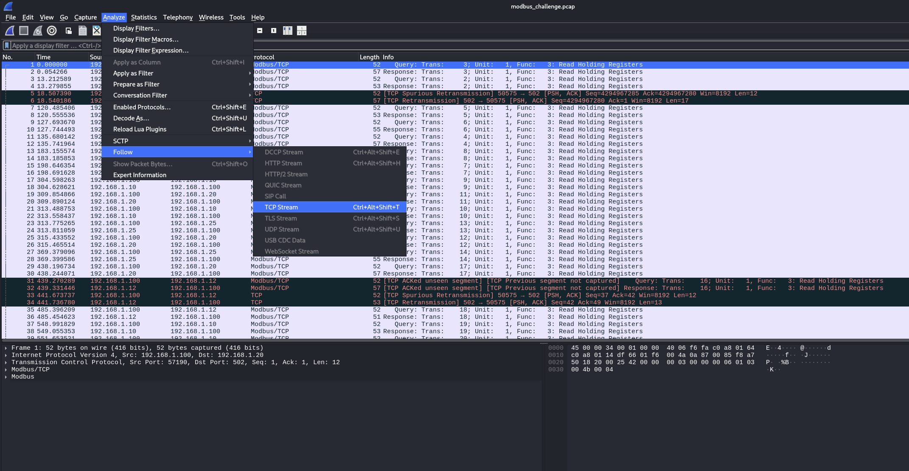
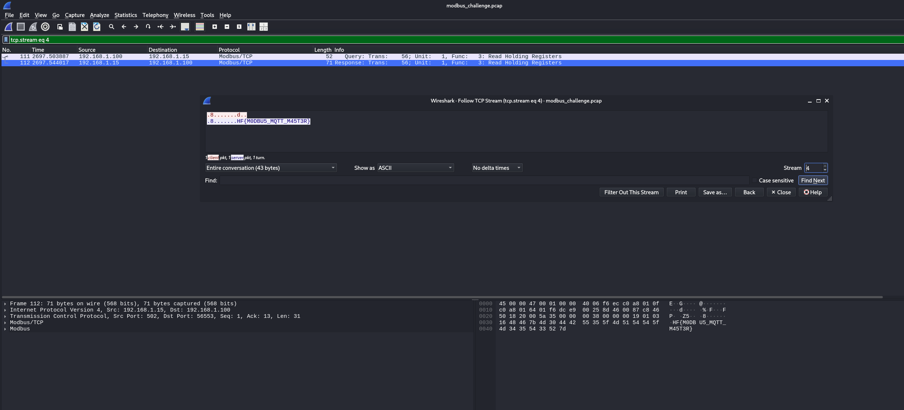

# 02 Modbus Sleuthing
Here we are given a file called `modbus_challenge.pcap` which is a packet capture that we can open with Wireshark. The description also mentions TCP, so we can guess that we should be interested in the TCP traffic in the packet capture.

By using the "Analyze" in Wireshark and "Follow TCP streams"

We can quickly find the flag by going through the TCP streams. We can find it in the fifth TCP stream. `HF{M0DBU5_MQTT_M45T3R}`

