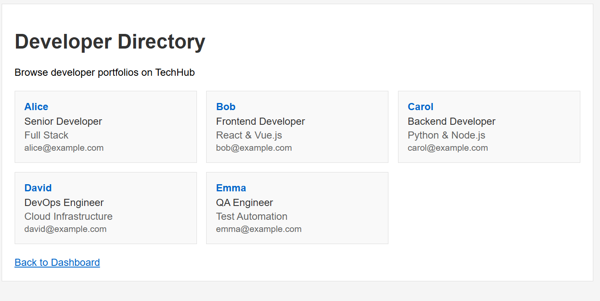

In this challenge we get given a website. The website has example logins for 4 users.

Logging in as Bob we have two options: "My Portfolio" and "Developer Directory". In the directory we can see 5 developers.

Since there was no login for Alice we assume she must have the flag.

The "My Portfolio" page for bob does not show much. But we notice the URL is https://f1x1t-wcd1.challenges.hfctf.ca/user/bob. Replacing `bob` with `alice` opens Alice's page which contains the flag `HF{wcd_ba$1c_$uccess}`.